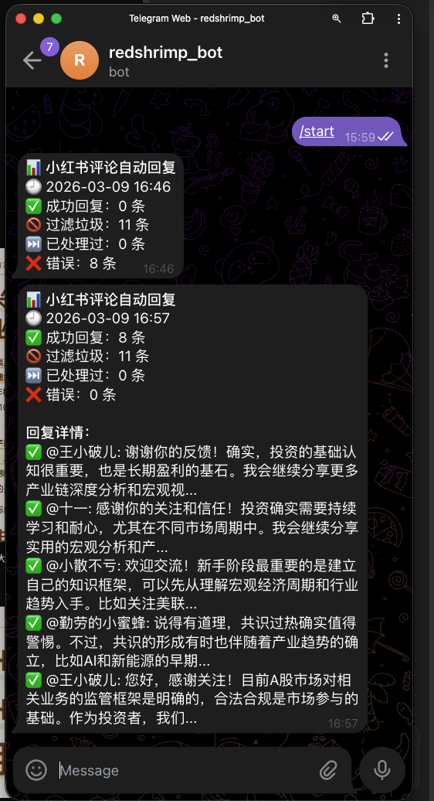

# 🤖 XHS Auto Reply — 小红书评论智能自动回复系统

> 基于 Playwright + DeepSeek，每天定时自动处理评论，过滤引流垃圾，生成专业回复，Telegram 实时推送报告。



---

## ✨ 功能特点

- **🕘 定时自动执行** — 每天 21:00 自动运行，无需人工干预
- **🧠 AI 生成回复** — 结合账号定位和笔记主题，生成自然、专业、有价值的回复
- **🚫 智能垃圾过滤** — 自动识别并跳过引流、广告、违规、无意义评论
- **🔒 低风险设计** — 使用本地真实 Chrome，随机延迟，模拟真人操作节奏
- **📱 Telegram 推送** — 每次执行后推送详细报告，随时掌握处理情况
- **📝 防重复机制** — 本地记录已处理评论，不会重复回复同一条

---

## 📊 实际效果

| 指标 | 数据 |
|------|------|
| 单次处理耗时 | 约 3~5 分钟 |
| 每日最大回复数 | 10 条（可配置） |
| 垃圾评论过滤率 | ~60%（引流广告居多） |
| AI 回复费用 | < ¥0.05 / 天 |

---

## 🏗 系统架构

```
Mac mini（常开）
    └── launchd 定时任务（每天 21:00 触发）
            └── Python 脚本
                    ├── Playwright → 控制本地 Chrome
                    │       ├── 打开小红书评论通知页
                    │       ├── 切换「评论和@」Tab
                    │       ├── 抓取当天新增评论
                    │       └── 逐条填入回复并发送
                    ├── 垃圾评论过滤器（关键词 + 规则）
                    ├── DeepSeek API → 生成专业回复
                    ├── 已处理记录（JSON 本地存储）
                    └── Telegram Bot → 推送执行报告
```

---

## 🚀 快速开始

### 前置条件

- macOS（Mac mini 推荐，需常开）
- Python 3.9+
- Chrome 浏览器
- [DeepSeek API Key](https://platform.deepseek.com)（或 OpenAI 兼容模型）
- Telegram Bot Token + Chat ID

### 第一步：克隆并安装依赖

```bash
git clone https://github.com/Fisher0012/xhs-auto-reply.git
cd xhs-auto-reply
bash setup.sh
```

### 第二步：配置参数

编辑 `xhs_reply.py`，修改以下配置：

```python
CONFIG = {
    "api_key": "你的 DeepSeek API Key",
    "telegram_bot_token": "你的 Telegram Bot Token",
    "telegram_chat_id": "你的 Telegram Chat ID",
}

ACCOUNT_PROFILE = """
你是「你的账号名」，专注于...（填入你的账号定位）
"""
```

### 第三步：首次登录小红书

```bash
python3 login_once.py
```

弹出 Chrome 窗口后手动登录，按 Enter 保存 Cookie。

### 第四步：注册定时任务

```bash
sed -i '' 's|/Users/fisher|/Users/你的用户名|g' com.xhs.autoreply.plist
cp com.xhs.autoreply.plist ~/Library/LaunchAgents/
launchctl load ~/Library/LaunchAgents/com.xhs.autoreply.plist
```

### 第五步：手动测试

```bash
python3 -c "import asyncio, xhs_reply; asyncio.run(xhs_reply.run())"
```

看到 Telegram 收到报告即代表部署成功 🎉

---

## 📁 项目结构

```
xhs-auto-reply/
├── xhs_reply.py                 # 主程序
├── login_once.py                # 首次登录（一次性）
├── com.xhs.autoreply.plist      # macOS 定时任务配置
├── setup.sh                     # 一键安装
├── SKILL.md                     # 通用 Skill（可扩展到其他平台）
├── docs/images/telegram_report.png
└── README.md
```

---

## 🔒 安全设计

| 机制 | 说明 |
|------|------|
| 真实浏览器环境 | 本地独立 Chrome Profile，设备指纹与真实用户一致 |
| 随机延迟启动 | 每次执行前随机等待 0~15 分钟 |
| 回复间随机间隔 | 每条间隔 8~25 秒，模拟真人打字节奏 |
| 每日上限 | 单次不超过 10 条 |
| 本地部署 | 不经过任何第三方服务器 |

> ⚠️ **免责声明**：任何自动化操作均有平台风控风险，请根据自身情况评估。

---

## 🛠 常见问题

**Q: Cookie 失效怎么办？**
```bash
python3 login_once.py
```

**Q: 想换其他平台（微博/抖音）怎么做？**
参考 `SKILL.md` 替换对应 CSS 选择器即可。

**Q: 如何查看运行日志？**
```bash
tail -f ~/xhs_auto_reply/logs/xhs_reply.log
```

---

## 🤝 贡献

欢迎提交 PR：新平台适配、垃圾过滤规则优化、回复质量提升方案。

---

## 📄 License

MIT License

---

## ⭐ 如果对你有帮助

给个 Star 支持一下 🙏，有问题欢迎提 Issue。
